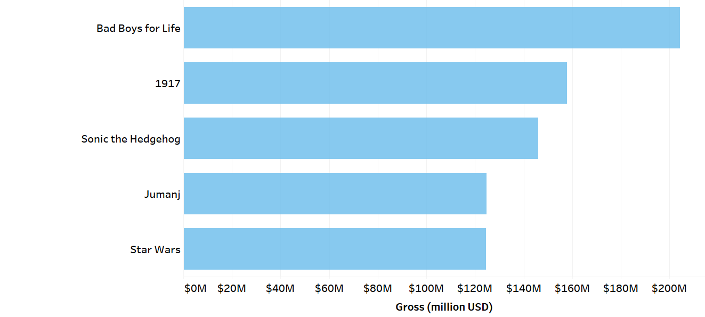
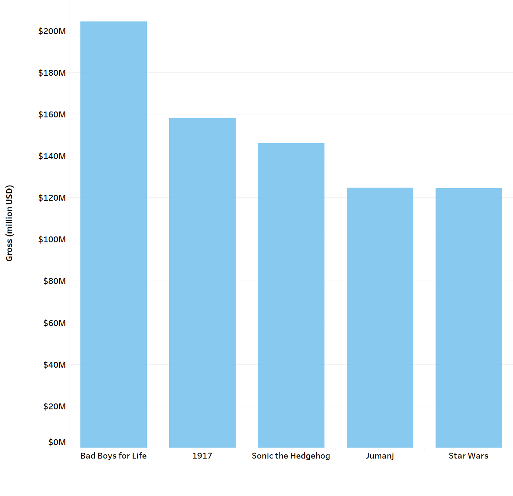

# Top 5 movies by gross value visualized as a barchart

The charts were built as a Tableau version of the chart 6.3. from chapter 6 of the book [Fundamentals of Data Visualization](https://serialmentor.com/dataviz/visualizing-amounts.html).

## Horizontal Barchart

## Vertical Barchart
